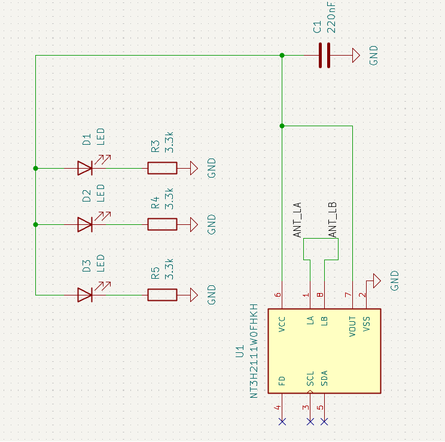
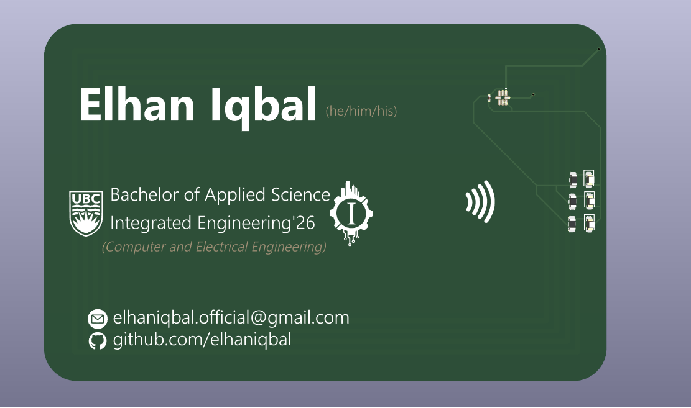

## Why a PCB business card

Honestly? Because during my final year, at some point I got bored, watched American Psycho and at the same time thought, this would be a cool way to recreate that scene except have it be 10x more nerdy. 

I have always been curious about the hardware side of things, I studied Integrated Engineering with a computer and electrical focus, so the electrical theory is there, but there is a difference between understanding circuits in a course and actually designing something you intend to manufacture. This felt like the right scale to bridge that gap: small enough to be achievable within a few hours, complex enough to teach me something real.

The constraint I gave myself: no battery. If I am handing this to someone, I do not want to worry about it being dead. NFC energy harvesting makes that possible. Also the components should be relatively cheap and easy to procure so I can easily just have JLCPCB do the manufacturing (and assembling).

## How it works

The core of the card is the **NXP NT3H2111W0FHKH** — the NTAG I²C Plus chip. It is a dual-interface NFC tag that does two things simultaneously: it serves NFC data to any phone that scans it, and it harvests energy from the phone's RF field through a `VOUT` pin. That harvested voltage, a few hundred milliwatts, is enough to drive three LEDs in parallel through current-limiting resistors.

So when you hold your phone to the card:

1. Your phone reads the NFC payload and gets redirected to wherever I want to send you (LinkedIn, portfolio, GitHub — configurable in the tag's NDEF memory)
2. Three LEDs light up, powered entirely by your phone's NFC transmitter
3. The whole thing looks way cooler than it has any right to

The schematic is simple: NT3H2111 with its `ANT_LA`/`ANT_LB` antenna pads, a 220 nF decoupling cap on `VCC`, and three LED+resistor pairs hanging off `VOUT` to ground. Each LED gets a 3.3 kΩ resistor to limit current within the VOUT rail's supply capability. The I²C lines (SCL, SDA) and field detect (FD) pin are broken out but not populated — they would be useful if I wanted to add a microcontroller later, but for a passive card they sit unused.

## Design decisions

The layout was done in KiCad. The antenna is a PCB trace coil — the quality factor matters a lot for harvesting efficiency, and I spent more time reading about coil geometry than I expected to. The NXP datasheet has reference antenna designs and I iterated from there.

The board color is dark green on render but in real life it's black, which is classic, but also makes the white silkscreen pop cleanly. The NFC symbol on the front is functional as a visual cue — people who know what it means tap immediately, and people who do not ask what it does, which starts a better conversation anyway.

One thing I deliberately kept off the board: a USB port or any active power circuit. Keeping it fully passive means nothing to charge, nothing to break, nothing to explain. The card works or it does not, and whether it works depends entirely on the antenna and chip, both of which are either soldered correctly or not.

## What I actually learned

I will admit the coil design was the lazy way: rather than working through the antenna math by hand, I ran the target inductance through [Konrad Beckmann's NFC antenna generator](https://kbeckmann.github.io/nfc-antenna-generator/), which spits out a trace geometry for a given number of turns, track width, and spacing. It got me a workable coil in minutes instead of an afternoon of derivation, and the harvested power turned out to be plenty for three LEDs, so I do not feel too bad about it.

Getting the phone to actually write the URL to the chip took longer than the coil did. In NFC Tools, reading the tag worked immediately, but writing to it did not — the direct write command just failed. The NT3H2111 comes off the reel in its factory state, and while that is enough for a phone to detect and read it, it is not yet set up to hold NDEF records like a URL. The fix was in the app's advanced commands section: an option specifically labeled "MIFARE Ultralight EV1: Format NDEF." Running that once against the chip prepared it properly, and the write went through immediately after.

PCB design has a surprisingly steep ramp even for simple boards. The DRC (design rule check) will catch your clearance violations, but it will not tell you that your antenna trace width is off or that your component footprint does not match the physical part you ordered. Those lessons arrive later.

I also learned that the gap between "this looks right in EDA software" and "this works in your hand" is where most of the education happens. You develop intuition for parasitic capacitance, for why ground planes matter, for why the datasheet's recommended layout exists for a reason. It is the same kind of muscle memory you build writing software — except the feedback loop is measured in weeks (fab turnaround) rather than milliseconds.

This is the kind of project I keep doing on the side because it keeps me honest about the full stack. I spend a lot of time in cloud infrastructure and software systems, and it is easy to lose touch with what happens at the physical layer. Building something with resistors and solder paste is a good reminder that computers are, at some level, just electricity moving through carefully shaped metal.
